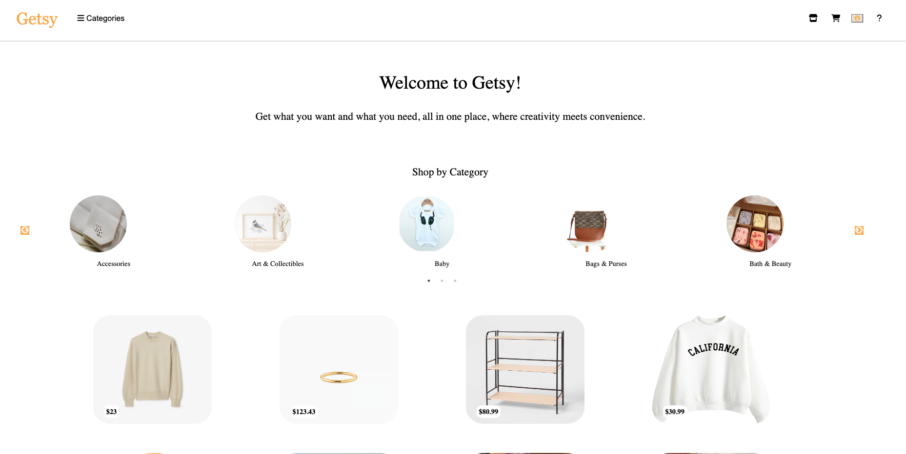

# Getsy

Getsy is a user-friendly e-commerce platform inspired by [Etsy](https://www.etsy.com/).

[Getsy] (https://getsy.onrender.com/)

## Wiki Links

- [User Stories](https://github.com/JomarAA/Getsy/wiki/User-Stories)
- [Feature List](https://github.com/JomarAA/Getsy/wiki/Feature-List)
- [Database Schema](https://github.com/JomarAA/Getsy/wiki/Database-Schema)
- [API Routes](https://github.com/JomarAA/Getsy/wiki/Routes)

## Preview

### Home Page



### Item Details Page


### Cart Page


## Getting started

1. Clone this repository (only this branch).

2. Install dependencies.

   ```bash
   pipenv install -r requirements.txt
   ```

3. Create a **.env** file based on the example with proper settings for your
   development environment.

4. Make sure the SQLite3 database connection URL is in the **.env** file.

5. This starter organizes all tables inside the `flask_schema` schema, defined
   by the `SCHEMA` environment variable. Replace the value for
   `SCHEMA` with a unique name, **making sure you use the snake_case
   convention.**

6. Get into your pipenv, migrate your database, seed your database, and run your
   Flask app:

   ```bash
   pipenv run flask db migrate
   ```

   ```bash
   flask db upgrade
   ```

   ```bash
   flask seed all
   ```

   ```bash
   flask run
   ```

## Languages and Technologies

- Python
- JavaScript
- Flask
- HTML5
- PostgreSQL
- CSS3
- React
- Redux
- AWS
